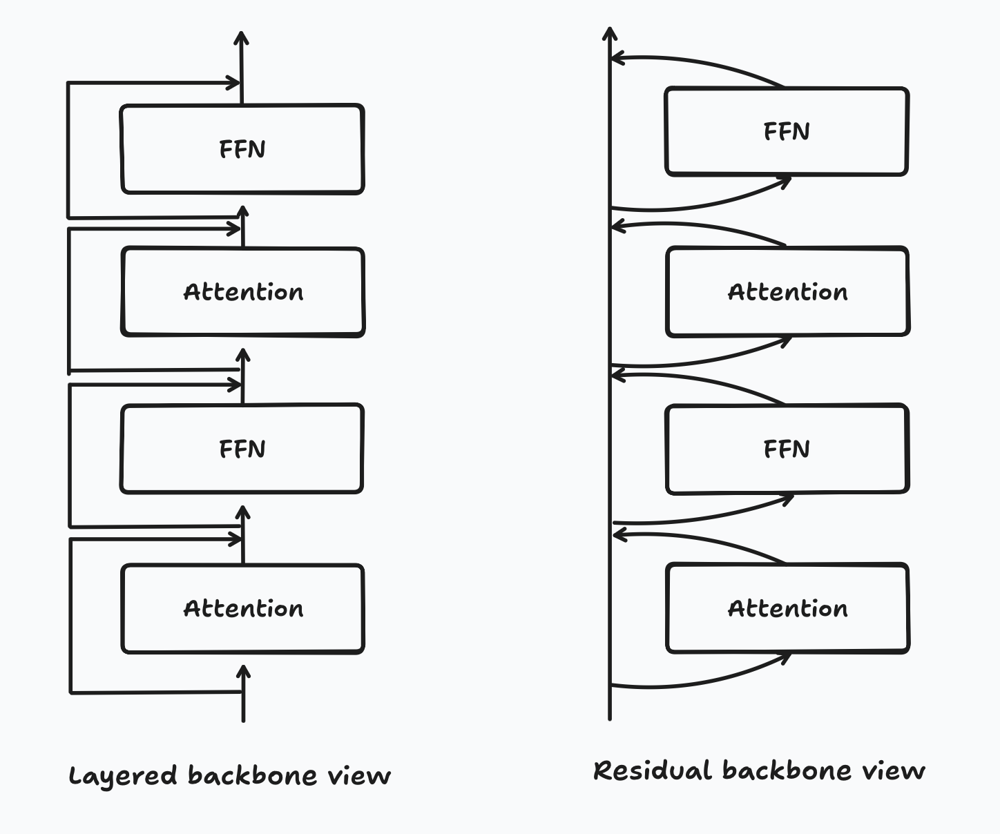
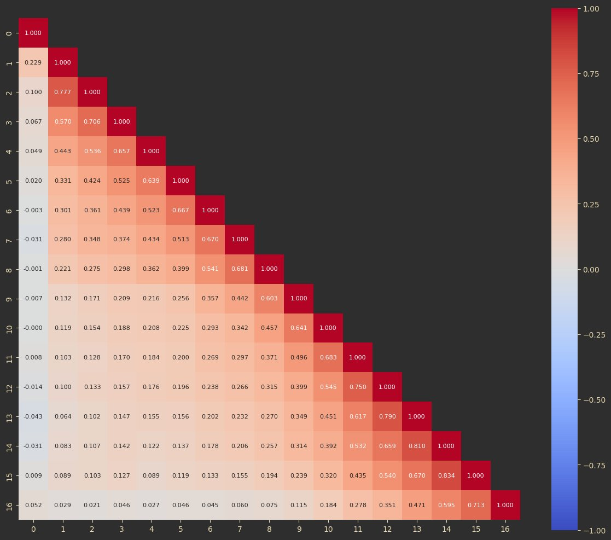
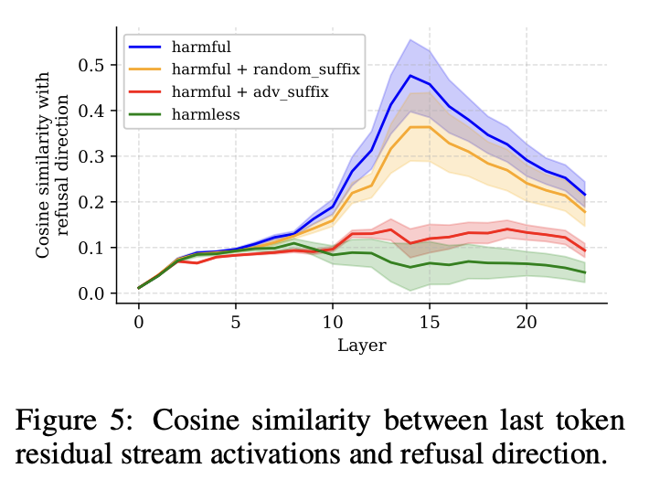
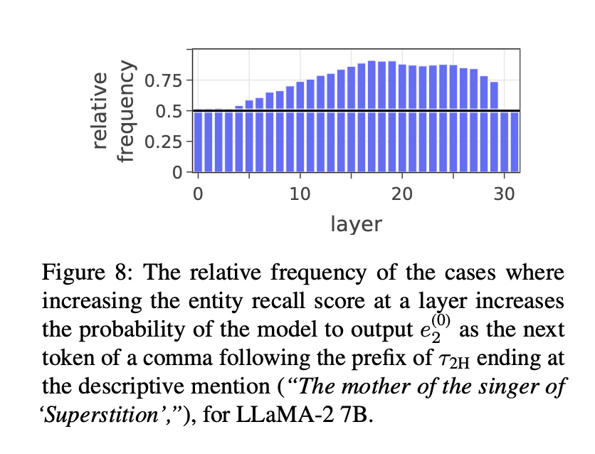

## Introduction
This post is meant to be an illustration of my mental model of a transformer, a sort of synthesis of a bunch of thoughts and ideas I've had over the past few months. It assumes knowledge on what a transformer architecture is. 

I see a lot of people say transformers are next-token predictors. And while that's true for how LLMs and other models may work, I feel like that still doesn't really give you a good mental model on how the transformer operates. Over time, I've developed a mental model that helps me make sense of transformer behavior: I view them fundamentally as contextualization machines. After all, next-token prediction is a learning objective, not an architecture. That said, I work with LLMs mainly so this post will still have a big focus on LLMs particularly (decoder-only architecture and all that). As we go through the post, we'll examine each component of a transformer through the lens of contextualization. I'll illustrate the mental model by showing how it helps frame different research results and papers.

When I talk about contextualization, I mean contextualization of tokens and hidden states. One view of the decoder-only transformer that I find useful is to think of the residual chain as the main backbone of the model and the layers as additive transformations, instead of thinking of the main flow of states through the layers as the backbone and the residuals as anchoring states or something along those lines. Here's a diagram to illustrate what I mean when I say this. 

In a sense, each layer's transformation of the hidden states can be viewed as a contextualization operation to the embedding, and then that contextualization is added back onto the token representation. If you graph out correlations (as cosine similarity) of hidden states between layers, you'll see that the hidden states after each layer are pretty similar to the hidden states before the layer, with a small difference (what I would call the extra contextualization). Here's a graph of cosine similarities between different layers' hidden states in Llama-3.2-1B.

So, imagining a contextualiztion operation as something that enriches a token embedding or hidden state with more information, let's see how I frame the transformer.

## The Tokenizer and The Embedding Matrix
The way I conceptualize the tokenizer and the embedding matrix as contextualization operations are pretty simple. The tokenizer's vocabulary size decides how many precontextualized pieces with which the final model will begin its forward pass, and the embedding matrix accumulates information that allows the pieces to be precontextualized during training. 

The embedding contains the context of the atoms (in the sense of atomic informational pieces, that cannot be broken down further) that make up a particular token. In general, the more of these atoms that are contained in a token, the more informational context is stored in the token. As an example, "hello" has a lot more information than "h".  You could say that the informational atoms contained within the token "hello" are more contextualized and have more contextualized meaning, since they are grouped together in a specific way, and their meaning is already combined at the embedding stage.

Now, extending this to the vocabulary size: for a given corpus, the greater the vocabulary size, the larger the tokens can end up being - and therefore the larger the groups of the atoms will be. This means that each embedding can have a more specific meaning at the start of the forward pass. 

### Over-Tokenized Transformer: Vocabulary is Generally Worth Scaling
This brings us to our first paper tie-in pretty nicely, the [Over-Tokenized Transformer paper](https://arxiv.org/abs/2501.16975). I'm just going to copy the abstract below:

> Tokenization is a fundamental component of large language models (LLMs), yet its influence on model scaling and performance is not fully explored. In this paper, we introduce Over-Tokenized Transformers, a novel framework that decouples input and output vocabularies to improve language modeling performance. Specifically, our approach scales up input vocabularies to leverage multi-gram tokens. Through extensive experiments, we uncover a log-linear relationship between input vocabulary size and training loss, demonstrating that larger input vocabularies consistently enhance model performance, regardless of model size. Using a large input vocabulary, we achieve performance comparable to double-sized baselines with no additional cost. Our findings highlight the importance of tokenization in scaling laws and provide practical insight for tokenizer design, paving the way for more efficient and powerful LLMs.

The main thing to take away from this paper is that they found that increasing tokenizer size consistently improves model performance, regardless of model size, and that there's a standard scaling-law type log-linear relationship between vocabulary size and training loss. 

Now this immediately makes perfect sense to me, viewing it from the lens of transformers being contextualization machines. In effect, it's moving some of the contextualization work from the model itself (the contextualization operations of the layers), and baking it into the the tokenizer + embedding matrix by allowing for greater precontextualization. More atoms of information can get packed into an embedding, and the embedding no longer has to be enriched by neighboring embeddings to reach an equivalent level of contextualization.

I'll try to illustrate this with an example again: let's say the smaller vocabulary has "he" and "llo" as separate tokens, and let's say the larger vocabulary has "hello" as a single token. The first model with the smaller vocabulary would have to go through at least one attention operation before each of the embeddings realize that they are part of the word "hello" - but in the larger model, the initial embedding out of the embedding matrix can already realize it's the word "hello". 

### Tokenization Issues and Jailbreaks
There's a lot of funny quirks about LLMs that people discover that end up being tied into the tokenizer, like counting letters in a word, for example. A lot of jailbreaks seem to rely on these tokenizer quirks too. Reading through a lot of jailbreaks, they rely on typos or typo-adjacent concepts like leetspeak. I think [this](https://github.com/elder-plinius/L1B3RT4S/blob/main/1337.mkd) is a nice example of what I mean. So what is it about typos, or more specifically, *slight* typos, that causes a jailbreak?

Once again, I think thinking of a transformer as a contextualization machine makes this intuitive to understand. Let's consider the case of the world "hello" and a version with typos, "hwllp". It's got two typos, but we can still figure out what it's supposed to mean. 

The word "hello" is counted as a single token. On the other hand, "hwllp" is tokenized as "hw" + "ll" + "p" (using the GPT-4o tokenizer). Since "hello" is a single token, after the embedding layer, its meaning is pre-contextualized: the model already knows what it means. However, since "hwllp" is 3 tokens, the model has to use at least one attention layer to figure out what is going on, to figure out what this is supposed to mean. "hw", "ll", and "p" don't have a ton of meaning pre-contextualized in each of them. The typos also add some additional noise in the meaning, as the model has to realize that these tokens all together represent a typo'd version of "hello". 

Now, extending this idea to jailbreaks: if the model has to spend additional layers to effectively denoise the input through contextualization, then the input may not be denoised soon enough for the model to contextualize the entire request as harmful. This would lead to a just-contextualized-enough-to-not-refuse embedding once we reach the LM-head, which in effect bypasses the internal computations required for the model to realize it needs to refuse. That's my hunch on why typos lend themselves to jailbreaks. I'll elaborate on it more in the next section, tying in a paper.

### Refusal in Language Models Is Mediated by a Single Direction
One thing that I think supports this framing of jailbreaks is [this paper](https://arxiv.org/abs/2406.11717). I'll copy the abstract below for easy reference.

> Conversational large language models are fine-tuned for both instruction-following and safety, resulting in models that obey benign requests but refuse harmful ones. While this refusal behavior is widespread across chat models, its underlying mechanisms remain poorly understood. In this work, we show that refusal is mediated by a one-dimensional subspace, across 13 popular open-source chat models up to 72B parameters in size. Specifically, for each model, we find a single direction such that erasing this direction from the model's residual stream activations prevents it from refusing harmful instructions, while adding this direction elicits refusal on even harmless instructions. Leveraging this insight, we propose a novel white-box jailbreak method that surgically disables refusal with minimal effect on other capabilities. Finally, we mechanistically analyze how adversarial suffixes suppress propagation of the refusal-mediating direction. Our findings underscore the brittleness of current safety fine-tuning methods. More broadly, our work showcases how an understanding of model internals can be leveraged to develop practical methods for controlling model behavior.

The paper is very interesting, and I especially like that since they identify refusal with a specific direction in embedding space, they can measure tending towards refusal per-layer. They do exactly that, and the graph they end up with is this.

This graph shows that the correlation with refusal directions for unsafe inputs generally arises around 75% of the way through the decoder stack. If typo-jailbreaks cause more layers to be spent on contextualization, then line in the graph should (possibly) shift right, and correlation with the refusal aspect wouldn't be great enough by the time the embedding reaches the LM head, leading to an effective jailbreak.

Through the tokenizer and embedding matrix, the model begins with precontextualized meanings, but these static representations need dynamic mechanisms to understand their role in sequence context.

## The Attention Mechanism
The attention mechanism is probably the meat of what comes to mind when the word "contextualization" is brought up in the context (lol) of transformers, and so I don't think I'll need to elaborate much on the mental model here. It's the only way token embeddings/hidden states interact with each other and share information in the transformer. 

One thing I will emphasize, though, is that I tend to imagine it as a local or in-context form of contextualization (how many times have I said this word now?).  The embeddings are receiving new information through their interactions with other embeddings, and this new information is used to enrich the meaning contained in each of them. However, this new information is specifically from the meanings contained in the other embeddings: for example, an embedding for "ball" might see that the words "black" and "white" appear in the token sequence preceding it. This could indicate that the ball is black and white, and that information might be incorporated into the "ball" embedding. The hidden state at the position of the "ball" token might now have information along the lines of "black and white ball". 

(Speculation territory warning) However, there's nothing to indicate that the ball might be a soccer ball from the attention mechanism's transformations alone, since the ball being a soccer ball isn't mentioned anywhere in the sequence. Therefore, I kind of view attention as a form of local contextualization, for information already contained within the sequence. Now, I could be wrong about this, and it's possible that the values added to the embedding in another attention layer might include some directional information about a soccer ball based on what the key sees in the query. But given how linked the attention mechanism is to in-context learning, I think this is a solid mental model.

While attention allows tokens to share and combine their meanings through local context, the model still needs a way to access broader knowledge beyond what's present in the input sequence.

## The Feed-Forward Layers
(Much of the intuition here is from 3blue1brown's video on how LLMs might store facts, and I highly recommend you watch it. The visuals are great.)
Now, in contrast to the attention mechanism, which works as a form of local contextualization, the feed-forward layers/multi-layer perceptron blocks act as a form of global contextualization. I like to think of it as seeing where the current embedding fits into the picture across the entire distribution of training data that the model has seen, through a directional lookup table. 

So in a transformer, the FFN is (usually) composed of two layers, an up-projection and a down-projection, both of which are matrix multiplications (with a non-linearity in between the two). The first matrix multiplication can be viewed as computing dot products between each row of the matrix and the embedding vector, which means the intermediate hidden state is a similarity vector encoding how similar each of the rows of the up-projection matrix were to the input hidden state. You could view it as a sort of weighted index into semantic directions in the embedding space, where the semantic directions are defined by the rows of the up-projections. "Where does this token fit in, in the context of this set of meanings I know?"

And then the down-projection can be viewed as retrieving relevant information based on those similarities, and collecting the information into a direction vector of size embedding_dim, which is then added onto the previous hidden state (through the residual connection). So I view it as contextualizing the hidden state in a "global" way, compared to a bunch of meanings the network as seen before during training. For example, this could add on some meaning in the direction "soccer" if there's a correlation with the vector representing "black and white ball" in the original hidden state.

This way, I view the forward pass through the main decoder stack as continuously adding additional meaning and refining the context of the tokens until their meaning is crystal clear. 

## The Learning Objective of Next-Token Prediction and the Language Model (LM) Head
I know, I said next-token prediction was the objective, not the architecture, but I think there's still something here that warrants a bit of discussion, as to how I fit it into my mental model. So the way I see it, since next-token prediction is the objective, information about the next token has to be incorporated into the hidden state at some point. So the way I model this in my head is that the attention contextualization operations not only incorporate information about previous tokens, but at the same time incorporate speculative information about what the future context looks like. I feel like the more information you know about what exact meaning a token has in a particular context, the clearer your speculations of what come next could be. 

The stronger the speculations get, the more the hidden state distribution begins to resemble the final output distribution. The way I view it, the later layers of the decoder end up having to focus more on this speculative contextualization since most of the hidden state meanings should be adequately contextualized by this point.

### The Language Model Head, or Unembedding Matrix
The way I imagine the language model head or unembedding matrix is that it extracts the speculative-next-token information from each token's fully contextualized representation. After going through all the layers of attention and feed-forward operations, each token embedding has become richly contextualized with both local and global information, and speculative information about what comes next as well. The unembedding matrix now just extracts the speculative information, and converts it into a probability distribution over the vocabulary of tokens.

### Better & Faster Large Language Models via Multi-token Prediction
This also makes multi-token prediction feel more intuitive. Let's take Meta's multi-token prediction setup as an example. Their architecture keeps the main trunk of the transformer unmodified, and then add multiple LM heads for multi-token prediction. I'll copy the abstract below once again. The link to the paper is [here](https://arxiv.org/abs/2404.19737).

> Large language models such as GPT and Llama are trained with a next-token prediction loss. In this work, we suggest that training language models to predict multiple future tokens at once results in higher sample efficiency. More specifically, at each position in the training corpus, we ask the model to predict the following n tokens using n independent output heads, operating on top of a shared model trunk. Considering multi-token prediction as an auxiliary training task, we measure improved downstream capabilities with no overhead in training time for both code and natural language models. The method is increasingly useful for larger model sizes, and keeps its appeal when training for multiple epochs. Gains are especially pronounced on generative benchmarks like coding, where our models consistently outperform strong baselines by several percentage points. Our 13B parameter models solves 12 % more problems on HumanEval and 17 % more on MBPP than comparable next-token models. Experiments on small algorithmic tasks demonstrate that multi-token prediction is favorable for the development of induction heads and algorithmic reasoning capabilities. As an additional benefit, models trained with 4-token prediction are up to 3 times faster at inference, even with large batch sizes.

Viewing this through the frame of a contextualization machine: thanks to the modified learning objective, the model is incentivized to speculatively contextualize further in the future, allowing the LM heads to extract multiple speculated tokens from the token embedding.

What's interesting about this paper is that the models show increased performance and richer internal representations (at larger model scales), and this improves downstream performance. This suggests that multi-token prediction fundamentally improves how the model processes and contextualizes information during the forward pass. This feels pretty intuitive to me: if the model is trained with signals from multiple token positions downstream, the contextualization operations are trained to speculate further into the future. It doesn't feel like too much of a stretch to imagine that stronger contextualization operations therefore lead to stronger representations of concepts within the model: the transformer is a contextualization machine.

## Do Large Language Models Latently Perform Multi-Hop Reasoning?
A final paper that I'd like to bring up is [this paper](https://arxiv.org/abs/2402.16837) by Deepmind. The abstract is as follows:

> We study whether Large Language Models (LLMs) latently perform multi-hop reasoning with complex prompts such as "The mother of the singer of 'Superstition' is". We look for evidence of a latent reasoning pathway where an LLM (1) latently identifies "the singer of 'Superstition'" as Stevie Wonder, the bridge entity, and (2) uses its knowledge of Stevie Wonder's mother to complete the prompt. We analyze these two hops individually and consider their co-occurrence as indicative of latent multi-hop reasoning. For the first hop, we test if changing the prompt to indirectly mention the bridge entity instead of any other entity increases the LLM's internal recall of the bridge entity. For the second hop, we test if increasing this recall causes the LLM to better utilize what it knows about the bridge entity. We find strong evidence of latent multi-hop reasoning for the prompts of certain relation types, with the reasoning pathway used in more than 80% of the prompts. However, the utilization is highly contextual, varying across different types of prompts. Also, on average, the evidence for the second hop and the full multi-hop traversal is rather moderate and only substantial for the first hop. Moreover, we find a clear scaling trend with increasing model size for the first hop of reasoning but not for the second hop. Our experimental findings suggest potential challenges and opportunities for future development and applications of LLMs.

In this paper, they introduce a metric called ENTREC that measures the model's internal recall of the bridge entity from its hidden representations. In Appendix C, they validate this metric by showing that when the internal recall of "Stevie Wonder" is increased at mid to late layers, the model becomes more likely to generate "Stevie" as the next token after a comma following the descriptive phrase. Interestingly, they plot out the effects of increasing this metric at specific layers, giving us this graph below:

I kinda view this as indirect support of our mental model. The effect slowly increases with layer depth, plateauing for a while, then decreasing as we get to the end of the decoder. In contextualizing framing, this means that as the hidden states get more contextualized, they slowly gather information about the token, and are more likely to make the retrieval hop. Seems to make sense. And then by the end of the decoder, the effect goes down as the hidden states have been contextualized enough and are now in the speculation phase.

The fact that they found strong evidence for first-hop reasoning but more moderate evidence for full multi-hop traversal also suggests that that the mental model of "first contextualize the tokens as much as you can and then speculatively contextualize them to gather information about potential next tokens" could be accurate. I suspect some sort of blocks-of-looped-layers type of architecture could help with this, but of course, there's tons of ways to do something like that, and I am far from sure on what the best approach is.

## Conclusion
Hopefully this blog post helped me convey my mental model of what a transformer does, and helped you get a stronger intuition for it.
