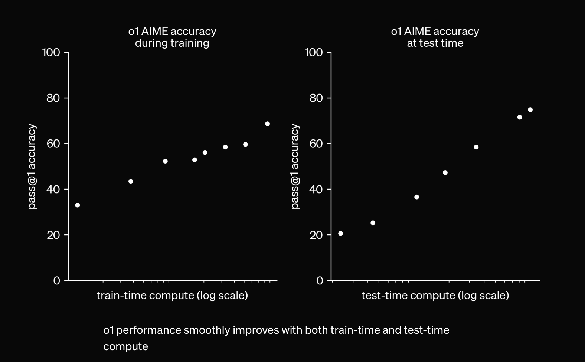

## Context
In the last week, there's been a few articles coming out about how LLM scaling has hit limitations — that labs are struggling to find ways to improve their frontier models. This all seems to have stemmed from [this](https://www.reuters.com/technology/artificial-intelligence/openai-rivals-seek-new-path-smarter-ai-current-methods-hit-limitations-2024-11-11/) Reuters article, which contains this sentence: "Ilya Sutskever, co-founder of AI labs Safe Superintelligence (SSI) and OpenAI, told Reuters recently that results from scaling up pre-training - the phase of training an AI model that uses a vast amount of unlabeled data to understand language patterns and structures - have plateaued."

Everyone's waiting for the next phase of frontier models: Claude 3.5 Opus, GPT-5, Gemini 2 (or 1.5 Ultra?), which have reportedly been struggling with benchmark scores (I don't remember which specific article stated this). This all has sparked discussion on whether LLM scaling has hit a wall. 

I don't think LLM scaling has hit a wall, nor do I think that pretraining scaling has hit a wall. But let's start with the overall scaling picture. 

(Disclaimer: It's my first time writing something like this, hope it's an enjoyable read. I am also using the term LLM in a more general way, including multimodal models.)

## Test-time scaling
I think the elephant in the room when scaling in general is brought up these days is test-time scaling — specifically OpenAI's o1, a model that generates chains of thought to reason before giving its final answer. You've probably seen the graph, but I'll put it here once more.

If the graph is to be believed, letting the model generate longer chains of thought yields better final performance. This is a form of scaling that's not related to training, and has really not been explored much yet beyond o1. As of writing this post, the full o1 hasn't been released to the public yet (you could argue that the public will never really see the full o1 due to safety guardrails). No other lab seems to have scaled test-time compute in a similar way yet, so there's plenty of improvement to be discovered here.

Here are some papers (brought to my attention by [Grad](https://x.com/Grad62304977) — go follow him) that seem promising along the o1 path.

[LANGUAGE MODELS ARE HIDDEN REASONERS: UNLOCKING LATENT REASONING CAPABILITIES VIA SELF-REWARDING](https://arxiv.org/pdf/2411.04282)

[Towards Learning to Reason at Pre-Training Scale](https://openreview.net/forum?id=BGnm7Lo8oW)

I think that it's generally accepted that test-time scaling is a massive research space to explore, and a path forward to continue compute scaling for intelligence. A recent paper even updated model gradients during test-time to great success.

Modifying model behavior to think for longer amoutns of time also kind of leads to the point that we can scale reinforcement learning post-training in general. Post training RL seems to have been focused on preference data, for safety and alignment purposes. There are a few projects like the ones previously mentioned that don't rely on human preference data for their reinforment learning — I've seen the term "self-play" used. There's a ton of space for LLMs to explore through these types of methods; I think that it's a promising research direction, and one that also requires a ton of compute to scale. We're nowhere near the limits of scaling on this side of the coin. But how about pretraining?

## Multimodality, Early Fusion, and continuing to scale pre-training

I would like to draw everyone's attention to the fact that besides GPT 4o, we are still yet to see a large-scale early fusion model from any of the big labs. Based on speed, we can also assume that 4o isn't really large-scale (read: GPT-4 scale), and yet it seems to allow for crazy new capabilities like advanced voice mode and the live camera input from the demos of advanced voice mode.

The reason I bring up multimodality is because of information density. Audio, image, and video data all contain a ton more information than text; an image is worth 16x16 words after all. There is an incredible amount of video content on the internet, and there have been some papers that attempt to tokenize video. There's some things you can't really fully describe in text, that can only be described in image or video form. Rotating a shape in your head, for example, or the way water splashes. I believe that video as a modality would allow LLMs to form clearer internal concepts and lead to better reasoning abilities as well. Maybe seeing someone draw out a diagram to explain a LeetCode problem will finally get us that 100% HumanEval score. And either way, it'll let models crystallize even more knowledge about the world. I think real large-scale fully multimodal training would necessitate a ton of model size scaling and compute scaling.

Not only do they contain a ton more information, but more modalities could unlock additional interactions. One thing that I think would be interesting is a real-time verison of the OpenAI advanced voice mode demos. Judging by 4o being an image+audio+text model, I would guess that their advanced voice mode demo sort of takes a snapshot when asked about what it's looking at. A real-time video model could watch continuously, and react accordingly. As an example:
"...Could you raise the camera up a li— cool, now I can see it. " Each forward pass of the model could receive a short clip, maybe?

I do think there's a bit of a research barrier to be crossed before we can scale up early fusion massively. The [Chameleon](https://arxiv.org/pdf/2405.09818) paper noted that "It was challenging to maintain stable training when scaling the Chameleon models above 8B parameters and 1T tokens, with instabilities often only arising very late in training." Another interesting quote from that paper is "Because we share all weights of the model across modalities, each modality will try to 'compete' with the other by increasing its norms slightly; while not problematic at the beginning of training, it manifests in divergences once we get outside the effective representation range of bf16." This could explain why we haven't seen many large-scale early fusion models yet, but they're coming. Two follow up papers from Meta, [MoMa](https://arxiv.org/pdf/2407.21770v1) and [Mixture of Transformers](https://arxiv.org/pdf/2411.04996), seem to be approaches that can mitigate this problem, though MoE models also seem to face stability challenges at large scale.

Mixture of Transformers also contains this line — "Training early-fusion multi-modal LLMs demands significantly larger datasets and computational resources compared to single-modality models." Given the advantages of early fusion, I don't think it's unlikely that we'll see pretraining continue to scale.

## Benchmarks

Benchmarks are not a good indicator of intelligence stagnation.

Evaluating the intelligence of these models is a hard problem, and I do appreciate just how difficult it is to design useful evaluation tasks. Evals *are* necessary, we do need measures to compare LLMs to one another.

That said, it's hard to boil intelligence down a few summary statistics. What do the percentage point gains on evals really mean? 

One problem with evaluations that I can't get over personally is that the difficulty of problems within an eval is likely not uniformly distributed. This would mean that each percentage point gain on an eval doesn't carry the same weight, in terms of intelligence measured. Going from a score of 50% to 55% might take a certain amount of additional intelligence, but going from 55% to 60% might take ten times as much additional intellignce, if the remaining 45% of the tasks in the problem set are much more difficult to solve. It's also probably difficult to tell beforehand what the distribution of difficulty within an eval problem set is — we don't have a good way to tell what's hard for LLMs (e.g. 9.11 vs 9.9). We also can't really measure LLM intelligence without these evals (that's the purpose of the evals, after all), so I'm not sure how one would go about verifying this. That said, I think it's very unlikely that problem difficulty is uniformly distributed within eval sets. If they're normally distributed (which they might be because things somehow end up that way) each percentage point definitely doesn't carry the same weight.

Another thing that complicates this is that since current benchmarks are being saturated, people are designing benchmarks that LLMs are currently very bad at, like the new FrontierMath one. This approach seems like it would skew the distribution of difficulty within the eval to the difficult side. What if LLMs continue getting more intelligent, and they don't crack much of these benchmarks, until suddenly, all at once, they get high scores? Would we think that LLMs have stagnated for all that time?

All this is to say that benchmark scores stagnating doesn't really indicate intelligence stagnating, or scaling plateauing.

Additionally, I do think that benchmarks these days are over-emphasized when it comes to new model releases. Every model release these days is accompanied by a matrix of the model's benchmark scores compared to other benchmarks. To the point where I wonder, would a frontier lab want to release a model that's more creative, more emotionally intelligent, more perceptive, better at multi-turn conversation consistency if it means sacrificing a few MMLU percentage points? 

The emphasis does make sense — it's a way for the public to quickly and easily compare models to each other. And the public's built up a ton of expectation around new frontier models. GPT-5 has a mythical idea being built up around them, especially with how long it's been since GPT-4. People are expecting a massive jump in benchmark numbers and capabilities, so the labs are worried about benchmark performance. I just doubt benchmarks can truly capture what improvements we might see.

## Distillation and trillions of parameters

Another thing that may explain the rumored lackluster performance of frontier models on benchmarks is distillation, which has allowed small models to have massive leaps in performance between generations. But the public might now attribute that leap not to distillation, but to some nebulous "generational improvement," which might now be expected of new frontier models. You can see this happen right now when people speculate what's going on with Claude 3.5 Opus, and how much of a jump they expect.

However, there's no giga-model that you can distill a frontier model from, since the giga-model would then be the frontier model. This is a sign, frontier labs. Please give us a ten trillion parameter model.

It's also worth mentioning that labs don't really seem to have scaled beyond 1.8 trillion parameters yet, and we're kind of just seeing improved models at smaller/equal scales than GPT-4 as architecture, training techniques, and data pipelines mature. Model size scaling hasn't really failed yet, because we haven't gone to crazy model sizes yet, because it's expensive.

## New and nuclear datacenters
Lastly, I think it makes sense to stop and take a look around. xAI just completed their 100k GPU cluster, with a plan to quickly expand to 200k GPUs. They're even using portable generators to power some of it. Last month, there were several news stories on frontier labs entering deals to build nuclear power plants to power upcoming datacenters. I believe Microsoft, Amazon and Google have all announced partnerships with energy companies for nuclear power. Sam Altman also has invested in a nuclear energy-related startup. These aren't plays that make sense if AI scaling has stopped.

I really think that there's a ton of scaling left to explore. Personally, I'm most excited to see how people scale post-training, since the latency introduced by scaling test-time compute can make it less of a "magical" experience. If any post-training researchers are reading this, it would be awesome to have a repo out there like [nanoGPT](https://github.com/karpathy/nanoGPT) but for post-training. If you made it this far — thanks for taking the time, and I hope you all enjoyed the read!
